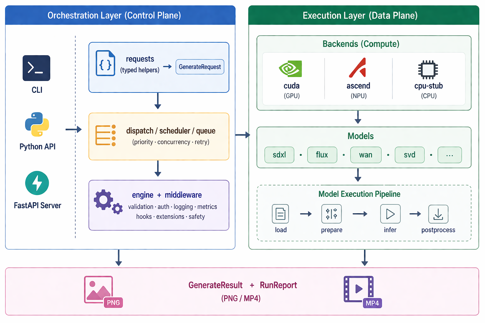

# OmniRT

<p align="center">
  <strong>Open inference runtime for realtime digital humans and multimodal agents</strong>
</p>

<p align="center">
  <a href="./README.md">中文</a> ·
  <a href="https://datascale-ai.github.io/omnirt/en/">Documentation</a> ·
  <a href="https://datascale-ai.github.io/omnirt/">中文文档</a> ·
  <a href="https://github.com/datascale-ai/omnirt">GitHub</a>
</p>

<p align="center">
  <a href="https://github.com/datascale-ai/omnirt/stargazers"></a>
  <a href="https://github.com/datascale-ai/omnirt/blob/main/LICENSE"></a>
  <a href="https://pypi.org/project/omnirt/"></a>
  
  
</p>

---

OmniRT is an open multimodal inference runtime for realtime digital humans and multimodal agents. It focuses on model execution, protocols, performance, deployment, health checks, benchmark artifacts, and capability declarations, with a unified request contract, realtime inference protocols, resident workers, CUDA / Ascend deployment, and integration foundations for OpenTalking, agent services, and custom frontends.

OmniRT is not an OpenTalking-only backend and it does not own business scenario packages such as government service, livestreaming, or customer support. OpenTalking is one important validation client. Persona packages, knowledge bases, customer pages, and business workflows belong in upper-layer systems; OmniRT core should expose Runtime Profiles, Model Capability Manifests, Benchmark Scenarios, and Integration Recipes.

OmniRT is no longer trying to be a broad model zoo. General image and video models that are already integrated remain available in the registry, but future maintenance effort is centered on the digital-human path: **TTS → audio-driven avatar → realtime serving → avatar assets / idle video → post-processing**.

## ✨ Highlights

- **Digital-human first** — talking avatars, TTS, avatar assets, idle video, and post-processing are the core scope
- **Unified contract** — `GenerateRequest`, `GenerateResult`, `RunReport` cover batch generation surfaces
- **Capability manifests** — `omnirt models --manifest` declares model task, I/O, streaming, resident, and backend status
- **Runtime profiles** — `omnirt profile validate` checks model composition, ports, VRAM budget, warmup, concurrency, and fallback config
- **Realtime avatar protocols** — FlashTalk-compatible WebSocket for OpenTalking compatibility, plus OmniRT Native Realtime Avatar WebSocket for new integrations
- **Cross-backend** — the same request validates and runs on `cuda` / `ascend` / `cpu-stub`
- **Three entry points** — Python API, CLI (`omnirt generate / validate / models`), FastAPI server
- **Core digital-human models** — FlashTalk / FlashHead / LiveAct / CosyVoice / SenseVoice are the current validation line
- **Standard artifacts** — PNG for images, WAV for audio, MP4 for videos, each run ships a `RunReport`
- **Offline-friendly** — local directories, Hugging Face, ModelScope, Modelers snapshots all supported
- **LoRA flexibility** — local safetensors and `hf://` single-file refs side by side
- **Async dispatch** — `queue` / `worker` / `policies` for batched requests and multi-model queueing
- **Pluggable telemetry** — `middleware.telemetry` streams runtime metrics into your stack
- **Safe defaults** — `--dry-run` and `validate` catch errors before you spin up hardware

## 🎯 Public Task Surfaces

| Task | Description | Typical output |
|---|---|---|
| `text2image` | prompt-driven image generation | PNG |
| `image2image` | image-guided image generation | PNG |
| `text2audio` | prompt-driven speech generation | WAV |
| `audio2text` | offline speech recognition / voice understanding | TXT |
| `text2video` | prompt-driven video generation | MP4 |
| `image2video` | first-frame-guided video generation | MP4 |
| `audio2video` | audio-driven talking avatar generation | MP4 |

`inpaint`, `edit`, and `video2video` are still evolving and exposed through model-specific entry points.

## 🚀 Quick Start

```bash
# Minimal install (with dev tooling)
pip install -e '.[dev]'

# Inspect the CLI
omnirt --help

# Local contract & parser tests
pytest
```

Install the extras you need:

```bash
# Run real models (diffusers / transformers / safetensors / torch)
pip install -e '.[runtime,dev]'

# Spin up the HTTP server
pip install -e '.[server]'

# Build / preview the docs
pip install -e '.[docs]'
```

Full walkthrough — first `validate` / `generate`, YAML request format, presets, `hf://` single-file LoRA refs — see [docs/getting_started/quickstart.en.md](./docs/getting_started/quickstart.en.md).

## FlashTalk 910B Runtime

FlashTalk on Ascend 910B is managed by `omnirt runtime`. Runtime artifacts default to `.omnirt/` inside this checkout; if checkpoints already exist, pass their paths and the installer will skip those directories. Run the following from the **OmniRT repository root**; paths are relative to that root:

```bash
python -m omnirt.cli.main runtime install flashtalk --device ascend \
  --ckpt-dir .omnirt/model-repos/SoulX-FlashTalk/models/SoulX-FlashTalk-14B \
  --wav2vec-dir .omnirt/model-repos/SoulX-FlashTalk/models/chinese-wav2vec2-base \
  --no-update \
  --recreate-venv
```

See [FlashTalk-compatible WebSocket](./docs/user_guide/serving/flashtalk_ws.en.md) for the directory layout, `--home` / `--repo-dir`, and launch steps.

## 🐍 Python API

```python
from omnirt import generate, requests

req = requests.text2image(
    model="flux2.dev",
    prompt="a cinematic sci-fi city at sunrise",
    preset="balanced",
)
result = generate(req, backend="cuda")
print(result.artifacts, result.report)
```

Full reference (typed request helpers, `pipeline(...)` wrapper, `RunReport` fields) lives in [docs/user_guide/serving/python_api.en.md](./docs/user_guide/serving/python_api.en.md).

## 🖥️ CLI

```bash
# List every registered model
omnirt models

# Emit a model capability manifest
omnirt models indextts --manifest

# Validate a multi-model Runtime Profile
omnirt profile validate examples/profiles/realtime-avatar-local.yaml

# Show metadata for one model (min_vram_gb, recommended presets, …)
omnirt models flux2.dev

# Validate a request without touching hardware
omnirt validate request.yaml

# Run the real generation
omnirt generate request.yaml --backend cuda --out ./out
```

CLI reference: [docs/cli_reference/index.en.md](./docs/cli_reference/index.en.md).

## 🧩 Digital-Human Model Scope

The authoritative list is generated from the live registry. The fastest way to see it:

```bash
omnirt models
omnirt models --tier core --manifest
```

A complete generated snapshot is at [docs/user_guide/models/supported_models.en.md](./docs/user_guide/models/supported_models.en.md); digital-human priorities and validation status live in [support_status.en.md](./docs/user_guide/models/support_status.en.md).

| Tier | Maintenance policy | Examples |
|---|---|
| Core | Requires registry, unit tests, real-hardware smoke, benchmark, and deployment docs | `soulx-flashtalk-14b`, `soulx-flashhead-1.3b`, `soulx-liveact-14b`, `cosyvoice3-triton-trtllm`, `sensevoice-small` |
| Adjacent | Supports avatar assets, backgrounds, idle video, and digital-human content production; smoke tests are added by scenario | `sdxl-base-1.0`, `flux2.dev`, `qwen-image`, `svd-xt`, `wan2.2-*` |
| Experimental | Keeps existing integrations, but is not a headline promise or dual-backend validation target | `kolors`, `pixart-sigma`, `bria-3.2`, `lumina-t2x`, `mochi`, `skyreels-v2`, and other general models |

General image and video models are not being removed immediately; they are being moved out of the main narrative into adjacent or experimental tiers so the project is not steered by model count alone.

## 🧱 Architecture



Layering, backend abstraction, and model adaptation notes live in [docs/developer_guide/architecture.en.md](./docs/developer_guide/architecture.en.md).

## 🧪 Testing & Validation

- `pytest tests/unit tests/parity` — contract and metrics layers
- `pytest tests/integration/test_error_paths.py` — low-memory and bad-weight failure paths
- CUDA / Ascend smoke tests auto-skip unless the required hardware, runtime packages, and local model directories are present

Real end-to-end generation still depends on the target hardware stack, runtime libraries, and model weights.

## 📦 Project Status

- `soulx-flashtalk-14b` has completed real-hardware validation on the Ascend 910B2 `persistent_worker` path
- `soulx-liveact-14b` and `soulx-flashhead-1.3b` are integrated through the `persistent_worker` execution surface, with script-backed generation retained inside the worker
- `cosyvoice3-triton-trtllm` is integrated as the CUDA-validated TTS baseline for the digital-human path
- `sensevoice-small` is integrated as the first offline ASR / `audio2text` entrypoint
- `sdxl-base-1.0` and `svd-xt` remain adjacent baselines for avatar assets and idle video material
- Editing models such as `flux-fill`, `flux-kontext`, `qwen-image-edit`, and `qwen-image-edit-plus` have smoke-test entry points and are maintained as adjacent asset capabilities
- `soulx-flashtalk-14b` can serve OpenTalking-style realtime avatar clients through the [FlashTalk-compatible WebSocket](./docs/user_guide/serving/flashtalk_ws.en.md) path
- Integration recipes live under [examples/integrations](./examples/integrations), with OpenTalking as one recipe rather than the only narrative center
- Other general image and video models stay in the registry, but they are no longer the validation priority
- The broader roadmap lives in [docs/user_guide/models/roadmap.en.md](./docs/user_guide/models/roadmap.en.md)

## 🚢 Deployment Topologies

Pick a topology that matches your hardware and scale:

| Topology | When to use | Docs |
|---|---|---|
| CUDA single node | NVIDIA GPU local inference / workstation | [cuda.en.md](./docs/user_guide/deployment/cuda.en.md) |
| Ascend single node | Ascend 910 / 310P and similar NPUs | [ascend.en.md](./docs/user_guide/deployment/ascend.en.md) |
| Docker | Container isolation, CI/CD, reproducible envs | [docker.en.md](./docs/user_guide/deployment/docker.en.md) |
| Distributed serving | Multi-GPU / multi-host / high-concurrency serving | [distributed_serving.en.md](./docs/user_guide/deployment/distributed_serving.en.md) |

### Pick a model source by network environment

OmniRT exposes a single model-source abstraction — swap it based on what your network can reach:

| Environment | Recommended sources | Notes |
|---|---|---|
| Direct Hugging Face access | `hf://` or `huggingface.co` repo ids | Default path, full registry access, `hf://` single-file LoRA refs |
| Hugging Face restricted (e.g. China) | ModelScope, HF-Mirror, Modelers | Use a mirror or `modelscope://` path; behaves the same as HF paths |
| Fully offline / air-gapped | Local directories + offline snapshots | On a connected machine, fetch with [`prepare_model_snapshot.py`](./scripts/prepare_model_snapshot.py) / [`prepare_modelscope_snapshot.py`](./scripts/prepare_modelscope_snapshot.py) / [`prepare_modelers_snapshot.py`](./scripts/prepare_modelers_snapshot.py), then push via [`sync_model_dir.sh`](./scripts/sync_model_dir.sh) |

Mirror configuration, environment variables, and the full offline flow (covering HF-Mirror / ModelScope / Modelers) live in [docs/user_guide/deployment/china_mirrors.en.md](./docs/user_guide/deployment/china_mirrors.en.md).

## 📚 Documentation

- **User guide**
  - Quickstart: [docs/getting_started/quickstart.en.md](./docs/getting_started/quickstart.en.md)
  - CLI reference: [docs/cli_reference/index.en.md](./docs/cli_reference/index.en.md)
  - Python API: [docs/user_guide/serving/python_api.en.md](./docs/user_guide/serving/python_api.en.md)
  - HTTP server: [docs/user_guide/serving/http_server.en.md](./docs/user_guide/serving/http_server.en.md)
  - Realtime avatar integration with [OpenTalking](https://github.com/zyairehhh/opentalking): [FlashTalk-compatible WebSocket](./docs/user_guide/serving/flashtalk_ws.en.md)
  - Presets: [docs/user_guide/features/presets.en.md](./docs/user_guide/features/presets.en.md)
  - Validation: [docs/user_guide/features/validation.en.md](./docs/user_guide/features/validation.en.md)
  - Service schema: [docs/user_guide/features/service_schema.en.md](./docs/user_guide/features/service_schema.en.md)
  - Dispatch & queue: [docs/user_guide/features/dispatch_queue.en.md](./docs/user_guide/features/dispatch_queue.en.md)
  - Telemetry: [docs/user_guide/features/telemetry.en.md](./docs/user_guide/features/telemetry.en.md)
- **Developer guide**
  - Architecture: [docs/developer_guide/architecture.en.md](./docs/developer_guide/architecture.en.md)
  - Model onboarding: [docs/developer_guide/model_onboarding.en.md](./docs/developer_guide/model_onboarding.en.md)
  - Backend onboarding: [docs/developer_guide/backend_onboarding.en.md](./docs/developer_guide/backend_onboarding.en.md)
  - Benchmark baseline: [docs/developer_guide/benchmark_baseline.en.md](./docs/developer_guide/benchmark_baseline.en.md)
  - Legacy optimization guide: [docs/developer_guide/legacy_optimization_guide.en.md](./docs/developer_guide/legacy_optimization_guide.en.md)
  - Contributing: [docs/developer_guide/contributing.en.md](./docs/developer_guide/contributing.en.md)
- **API reference**: [docs/api_reference/index.en.md](./docs/api_reference/index.en.md)

## 🔧 Utilities

| Script | Purpose |
|---|---|
| [`scripts/prepare_model_snapshot.py`](./scripts/prepare_model_snapshot.py) | Prepare offline Hugging Face model snapshots |
| [`scripts/prepare_modelers_snapshot.py`](./scripts/prepare_modelers_snapshot.py) | Clone Modelers repositories for offline use |
| [`scripts/prepare_modelscope_snapshot.py`](./scripts/prepare_modelscope_snapshot.py) | Prepare ModelScope repositories and large files |
| [`scripts/check_model_layout.py`](./scripts/check_model_layout.py) | Validate local model directory layout |
| [`scripts/sync_model_dir.sh`](./scripts/sync_model_dir.sh) | Sync model directories to remote servers |
| [`model_backends/`](./model_backends/) | Manage isolated model backend environments, dependencies, and launch assets while keeping OmniRT lightweight |
| `omnirt runtime install flashtalk --device ascend` | Prepare the FlashTalk 910B model environment, external checkout, and checkpoints |
| [`scripts/start_flashtalk_ws.sh`](./scripts/start_flashtalk_ws.sh) | Start the [FlashTalk-compatible WebSocket](./docs/user_guide/serving/flashtalk_ws.en.md) service for [OpenTalking](https://github.com/zyairehhh/opentalking)-style realtime avatar clients |

## 🤝 Contributing

Issues and PRs are welcome. Please read the [contributing guide](./docs/developer_guide/contributing.en.md) and make sure `pytest` and `pre-commit run -a` pass locally.

## 📄 License

Released under the [MIT License](./LICENSE).
