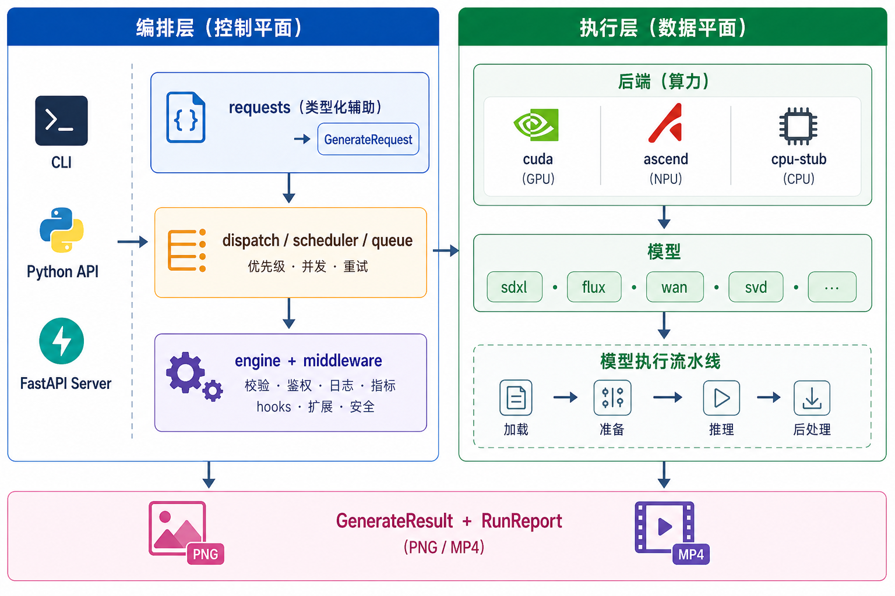

# OmniRT

<p align="center">
  <strong>面向实时数字人与多模态 Agent 的开放推理运行时</strong>
</p>

<p align="center">
  <a href="./README.en.md">English</a> ·
  <a href="https://datascale-ai.github.io/omnirt/">文档站点</a> ·
  <a href="https://datascale-ai.github.io/omnirt/en/">English Docs</a> ·
  <a href="https://github.com/datascale-ai/omnirt">GitHub</a>
</p>

<p align="center">
  <a href="https://github.com/datascale-ai/omnirt/stargazers"></a>
  <a href="https://github.com/datascale-ai/omnirt/blob/main/LICENSE"></a>
  <a href="https://pypi.org/project/omnirt/"></a>
  
  
</p>

---

OmniRT 是一个面向实时数字人与多模态 Agent 的开放多模态推理运行时，围绕模型运行、协议、性能、部署、健康检查、benchmark 和能力声明，提供统一请求契约、实时推理协议、常驻 worker、跨 CUDA / Ascend 后端部署，以及面向 OpenTalking、Agent 服务和自研前端的接入基础。

OmniRT 不是 OpenTalking 专用后端，也不承载政务、直播、客服等业务场景包。OpenTalking 是重点参考接入方之一；Persona、知识库、客户页面和业务流程应放在上层系统，OmniRT 核心只沉淀 Runtime Profile、Model Capability Manifest、Benchmark Scenario 和 Integration Recipe。

OmniRT 不再追求成为“大而全”的通用模型库。已经适配的泛图像 / 泛视频模型会保留在 registry 中，但后续维护资源优先投向数字人主链路：**TTS → 音频驱动数字人 → 实时流式服务 → 角色资产 / idle 素材 → 后处理增强**。

## ✨ 核心亮点

- **数字人链路优先** — 核心覆盖 talking avatar、TTS、角色资产、idle 视频素材与后处理路线图
- **统一请求契约** — `GenerateRequest`、`GenerateResult`、`RunReport` 三个对象覆盖 batch 生成任务面
- **运行时能力声明** — `omnirt models --manifest` 输出模型任务、输入输出、streaming、resident 与后端状态
- **Runtime Profile** — `omnirt profile validate` 校验模型组合、端口、显存预算、预热、并发和降级配置
- **实时数字人协议** — FlashTalk-compatible WebSocket 兼容 OpenTalking，OmniRT Native Realtime Avatar WebSocket 面向新集成
- **跨后端运行时** — 同一份请求可在 `cuda` / `ascend` / `cpu-stub` 上完成校验与执行
- **三种入口** — Python API、CLI (`omnirt generate / validate / models`)、FastAPI 服务
- **核心数字人模型** — FlashTalk / FlashHead / LiveAct / CosyVoice / SenseVoice 作为当前主线验证对象
- **产物标准化** — 图像统一导出为 PNG，音频统一导出为 WAV，视频统一导出为 MP4，每次运行都会生成一份 `RunReport`
- **离线与国内环境友好** — 同时支持本地目录、Hugging Face、ModelScope、Modelers 快照
- **LoRA 灵活加载** — 本地 safetensors 与 `hf://` 单文件引用并存
- **异步派发** — `queue` / `worker` / `policies` 支持批量请求与多模型排队执行
- **可插拔遥测** — `middleware.telemetry` 可将运行指标接入你现有的观测体系
- **安全默认** — `--dry-run` 与 `validate` 能让你在真机运行前尽早发现问题

## 🎯 公开任务面

| 任务 | 说明 | 典型输出 |
|---|---|---|
| `text2image` | 文本驱动图像生成 | PNG |
| `image2image` | 图像引导图像生成 | PNG |
| `text2audio` | 文本驱动语音生成 | WAV |
| `text2video` | 文本驱动视频生成 | MP4 |
| `image2video` | 首帧引导视频生成 | MP4 |
| `audio2video` | 音频驱动说话数字人 | MP4 |
| `audio2text` | 离线语音识别 / 语音理解 | TXT |

`inpaint`、`edit`、`video2video` 仍在持续演进，目前先通过模型特定入口提供。

## 🚀 快速开始

```bash
# 最小安装(含开发工具链)
pip install -e '.[dev]'

# 查看 CLI
omnirt --help

# 运行本地契约与解析层测试
pytest
```

如果需要实际运行模型，再按需安装以下扩展：

```bash
# 运行模型(diffusers / transformers / safetensors / torch)
pip install -e '.[runtime,dev]'

# 启动 HTTP 服务
pip install -e '.[server]'

# 构建 / 预览文档
pip install -e '.[docs]'
```

完整的入门流程（包括首次 `validate` / `generate`、YAML 请求格式、preset，以及 `hf://` 单文件 LoRA 引用）见 [docs/getting_started/quickstart.md](./docs/getting_started/quickstart.md)。

## FlashTalk 910B Runtime

FlashTalk 的 Ascend 910B 环境由 `omnirt runtime` 单独管理，默认产物放在当前项目的 `.omnirt/` 下；如果已有模型权重，可以直接指定路径，安装器会跳过已存在的目录。以下命令在 **OmniRT 仓库根目录** 执行，路径相对该根目录：

```bash
python -m omnirt.cli.main runtime install flashtalk --device ascend \
  --ckpt-dir .omnirt/model-repos/SoulX-FlashTalk/models/SoulX-FlashTalk-14B \
  --wav2vec-dir .omnirt/model-repos/SoulX-FlashTalk/models/chinese-wav2vec2-base \
  --no-update \
  --recreate-venv
```

详细目录结构、`--home` / `--repo-dir` 用法和 WebSocket 启动流程见 [FlashTalk 兼容 WebSocket](./docs/user_guide/serving/flashtalk_ws.md)。

## 🐍 Python API

```python
from omnirt import generate, requests

req = requests.text2image(
    model="flux2.dev",
    prompt="a cinematic sci-fi city at sunrise",
    preset="balanced",
)
result = generate(req, backend="cuda")
print(result.artifacts, result.report)
```

更多 helper（包括各任务的 typed request、`pipeline(...)` 便捷封装，以及 `RunReport` 字段说明）见 [docs/user_guide/serving/python_api.md](./docs/user_guide/serving/python_api.md)。

## 🖥️ 命令行

```bash
# 列出全部已注册模型
omnirt models

# 输出模型能力声明
omnirt models indextts --manifest

# 校验多模型运行时 Profile
omnirt profile validate examples/profiles/realtime-avatar-local.yaml

# 查看单个模型的元信息(min_vram_gb、推荐 preset 等)
omnirt models flux2.dev

# 先做一次请求校验(不会真正跑模型)
omnirt validate request.yaml

# 真机生成
omnirt generate request.yaml --backend cuda --out ./out
```

CLI 参考见 [docs/cli_reference/index.md](./docs/cli_reference/index.md)。

## 🧩 数字人链路模型边界

权威清单由 registry 实时生成，建议以 CLI 输出为准：

```bash
omnirt models
omnirt models --tier core --manifest
```

对应的完整文档镜像见 [docs/user_guide/models/supported_models.md](./docs/user_guide/models/supported_models.md)，数字人优先级与验证状态见 [support_status.md](./docs/user_guide/models/support_status.md)。

| 层级 | 维护策略 | 代表模型 |
|---|---|---|
| Core | 必须有 registry、单测、真机 smoke、benchmark 与部署文档 | `soulx-flashtalk-14b`, `soulx-flashhead-1.3b`, `soulx-liveact-14b`, `cosyvoice3-triton-trtllm` |
| Adjacent | 服务于角色资产、背景、idle 视频、数字人素材生产，按场景补 smoke | `sdxl-base-1.0`, `flux2.dev`, `qwen-image`, `svd-xt`, `wan2.2-*` |
| Experimental | 保留已接入能力，不再作为主卖点或双后端验证承诺 | `kolors`, `pixart-sigma`, `bria-3.2`, `lumina-t2x`, `mochi`, `skyreels-v2` 等泛模型 |

泛图像 / 泛视频模型不会立即删除；它们会从 README 主线叙事中下沉到 experimental 或 adjacent 层，避免项目目标被“模型越多越好”带偏。

## 🧱 架构速览



关于架构分层、后端抽象和模型适配的更多细节，见 [docs/developer_guide/architecture.md](./docs/developer_guide/architecture.md)。

## 🧪 测试与验证

- `pytest tests/unit tests/parity` — 覆盖本地契约层与指标层
- `pytest tests/integration/test_error_paths.py` — 覆盖低显存、坏权重等错误路径
- CUDA / Ascend smoke tests 在缺少硬件、运行时依赖或本地模型目录时会自动跳过

真正的端到端生成仍依赖目标硬件环境、运行时依赖和模型权重。

## 📦 当前状态

- `soulx-flashtalk-14b` 已在 Ascend 910B2 常驻 `persistent_worker` 链路完成真机验证
- `soulx-liveact-14b` 与 `soulx-flashhead-1.3b` 已通过 script-backed wrapper 接入 `audio2video`
- `cosyvoice3-triton-trtllm` 已接入 `text2audio`，作为数字人 TTS 链路的 CUDA 验证基线
- `sdxl-base-1.0` 与 `svd-xt` 保留为角色资产和 idle 视频素材的 adjacent 基线
- `flux-fill`、`flux-kontext`、`qwen-image-edit`、`qwen-image-edit-plus` 等编辑模型已经接入 smoke 入口，按 adjacent 素材能力维护
- `soulx-flashtalk-14b` 可通过 [FlashTalk 兼容 WebSocket](./docs/user_guide/serving/flashtalk_ws.md) 接入 OpenTalking 等实时数字人链路
- 其他泛图像 / 泛视频模型会继续保留 registry，但不再作为后续验证优先级
- 更完整的路线图见 [docs/user_guide/models/roadmap.md](./docs/user_guide/models/roadmap.md)

## 🚢 部署形态

你可以根据硬件条件与部署规模选择合适的部署形态：

| 形态 | 适用场景 | 文档 |
|---|---|---|
| CUDA 单机 | NVIDIA GPU 本地推理 / 开发机 | [cuda.md](./docs/user_guide/deployment/cuda.md) |
| Ascend 单机 | 昇腾 910 / 310P 等 NPU | [ascend.md](./docs/user_guide/deployment/ascend.md) |
| Docker | 容器化隔离、CI/CD、可复制环境 | [docker.md](./docs/user_guide/deployment/docker.md) |
| 分布式服务 | 多卡 / 多机 / 高并发在线服务 | [distributed_serving.md](./docs/user_guide/deployment/distributed_serving.md) |

### 按网络环境选择模型源

OmniRT 对模型来源做了统一抽象，你可以根据网络可达性灵活切换：

| 网络环境 | 推荐模型源 | 建议 |
|---|---|---|
| 可直连 Hugging Face | `hf://` 或 `huggingface.co` repo id | 默认方案，可获得最完整的模型矩阵与 `hf://` 单文件 LoRA 支持 |
| 国内 / Hugging Face 受限 | ModelScope、HF-Mirror、Modelers | 可通过镜像或 `modelscope://` 路径加载，使用体验与 HF 路径等价 |
| 完全离线 / 内网 | 本地模型目录 + 离线快照 | 可先在有网机器上用 [`prepare_model_snapshot.py`](./scripts/prepare_model_snapshot.py) / [`prepare_modelscope_snapshot.py`](./scripts/prepare_modelscope_snapshot.py) / [`prepare_modelers_snapshot.py`](./scripts/prepare_modelers_snapshot.py) 拉取快照，再用 [`sync_model_dir.sh`](./scripts/sync_model_dir.sh) 同步到目标机器 |

镜像配置、环境变量和完整的离线流程见 [docs/user_guide/deployment/china_mirrors.md](./docs/user_guide/deployment/china_mirrors.md)（覆盖 HF-Mirror / ModelScope / Modelers 三类镜像源）。

## 📚 文档导航

- **用户指南**
  - 快速开始:[docs/getting_started/quickstart.md](./docs/getting_started/quickstart.md)
  - CLI 参考:[docs/cli_reference/index.md](./docs/cli_reference/index.md)
  - Python API:[docs/user_guide/serving/python_api.md](./docs/user_guide/serving/python_api.md)
  - HTTP 服务:[docs/user_guide/serving/http_server.md](./docs/user_guide/serving/http_server.md)
  - 配合 [OpenTalking](https://github.com/zyairehhh/opentalking) 的实时数字人接入:[FlashTalk 兼容 WebSocket](./docs/user_guide/serving/flashtalk_ws.md)
  - 预设 Presets:[docs/user_guide/features/presets.md](./docs/user_guide/features/presets.md)
  - 请求校验:[docs/user_guide/features/validation.md](./docs/user_guide/features/validation.md)
  - 服务协议 Schema:[docs/user_guide/features/service_schema.md](./docs/user_guide/features/service_schema.md)
  - Runtime Profile / Capability Manifest:[docs/user_guide/features/runtime_profiles.md](./docs/user_guide/features/runtime_profiles.md)
  - 派发与队列:[docs/user_guide/features/dispatch_queue.md](./docs/user_guide/features/dispatch_queue.md)
  - 遥测:[docs/user_guide/features/telemetry.md](./docs/user_guide/features/telemetry.md)
- **接入示例**
  - OpenTalking:[examples/integrations/opentalking](./examples/integrations/opentalking)
  - 通用 Agent 服务:[examples/integrations/agent-service](./examples/integrations/agent-service)
  - CLI / HTTP Demo:[examples/integrations/http-cli-demo](./examples/integrations/http-cli-demo)
- **开发者指南**
  - 架构说明:[docs/developer_guide/architecture.md](./docs/developer_guide/architecture.md)
  - 模型接入:[docs/developer_guide/model_onboarding.md](./docs/developer_guide/model_onboarding.md)
  - 后端接入:[docs/developer_guide/backend_onboarding.md](./docs/developer_guide/backend_onboarding.md)
  - Benchmark 基线:[docs/developer_guide/benchmark_baseline.md](./docs/developer_guide/benchmark_baseline.md)
  - Legacy 优化指南:[docs/developer_guide/legacy_optimization_guide.md](./docs/developer_guide/legacy_optimization_guide.md)
  - 贡献指南:[docs/developer_guide/contributing.md](./docs/developer_guide/contributing.md)
- **API 参考**:[docs/api_reference/index.md](./docs/api_reference/index.md)

## 🔧 工具脚本

| 脚本 | 用途 |
|---|---|
| [`scripts/prepare_model_snapshot.py`](./scripts/prepare_model_snapshot.py) | 准备离线 Hugging Face 模型快照 |
| [`scripts/prepare_modelers_snapshot.py`](./scripts/prepare_modelers_snapshot.py) | 拉取 Modelers 仓库快照 |
| [`scripts/prepare_modelscope_snapshot.py`](./scripts/prepare_modelscope_snapshot.py) | 准备 ModelScope 仓库及大文件 |
| [`scripts/check_model_layout.py`](./scripts/check_model_layout.py) | 检查本地模型目录布局 |
| [`scripts/sync_model_dir.sh`](./scripts/sync_model_dir.sh) | 把模型目录同步到远程服务器 |
| [`model_backends/`](./model_backends/) | 管理独立模型后端环境、依赖和启动资产，保持 OmniRT 框架环境轻量 |
| `omnirt runtime install flashtalk --device ascend` | 准备 FlashTalk 910B 模型环境、外部 checkout 和权重 |
| [`scripts/start_flashtalk_ws.sh`](./scripts/start_flashtalk_ws.sh) | 启动 [FlashTalk 兼容 WebSocket](./docs/user_guide/serving/flashtalk_ws.md) 服务，供 [OpenTalking](https://github.com/zyairehhh/opentalking) 等实时数字人客户端接入 |

## 🤝 参与贡献

欢迎提交 Issue 和 PR。提交前请先阅读 [贡献指南](./docs/developer_guide/contributing.md)，并运行 `pytest` 与 `pre-commit run -a`，确保本地检查通过。

## 📄 许可证

本项目基于 [MIT License](./LICENSE) 发布。
